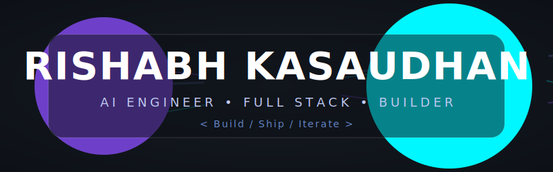

<div align="center">



</div>

<div align="center">

[](https://git.io/typing-svg)

</div>

<br/>

<div align="center">

[](https://your-portfolio-link.com)
[](https://linkedin.com/in/your-linkedin)
[](https://twitter.com/your-twitter)
[](mailto:rkasaudhan87@gmail.com)
[](https://github.com/Rishabh893-ux)
[](https://instagram.com/rishabhkasaudhan4364)

</div>
 
<br/>

---


## 🧠 About me

```typescript
const rishabh = {
  role: ["AI Engineer", "Full Stack Developer"],
  location: "India 🇮🇳",
  mindset: "Build → Ship → Iterate 🚀",
  focus: [
    "AI-powered web applications",
    "Scalable full stack architectures"
  ],
  askMeAbout: ["Python", "React", "MongoDB", "GenAI"],
  funFact: "I build what I wish already existed. ✨",
  status: "Building in public",
  openTo: ["Collaborations", "Internships", "Freelance"]
};
```

---

## 🛠️ Tech stack

<div align="center">

### Languages
<a href="https://skillicons.dev">
  
</a>

### Frontend
<a href="https://skillicons.dev">
  
</a>

### Backend & Database
<a href="https://skillicons.dev">
  
</a>

### AI & Automation
<div align="center">
  
  
  
  
  
</div>

### Cloud & DevOps
<a href="https://skillicons.dev">
  
</a>

</div>

---

## 🚀 Featured projects

<div align="center">
<table>
<tr>
<td width="50%" valign="top">

### ⚡ [AutoStack-Launcher](https://github.com/Rishabh893-ux/AutoStack-Launcher)
> Automation & dev workflow tool

Automates full dev environment setup — installs dependencies, configures tools, and launches project stacks with a single command. Built for speed.

`Python` `CLI` `Automation` `DevOps`

[](https://github.com/Rishabh893-ux/AutoStack-Launcher)

</td>
<td width="50%" valign="top">

### 🤖 [College Enquiry Chatbot](https://github.com/Rishabh893-ux/college-enquiry-chatbot)
> AI-powered student assistant

NLP chatbot for admission queries, fees, courses, and FAQs. Handles intent classification and context — no repeated questions.

`Python` `Flask` `NLP` `AI`

[](https://github.com/Rishabh893-ux/college-enquiry-chatbot)

</td>
</tr>
<tr>
<td width="50%" valign="top">

### 🎬 [Movie Scout](https://github.com/Rishabh893-ux/movie-scout)
> Smart movie discovery platform

Recommends movies based on user preferences using external APIs, smart filtering, and a responsive React UI. Fast, clean, and intuitive.

`React` `JavaScript` `REST API` `CSS`

[](https://github.com/Rishabh893-ux/movie-scout)

</td>
<td width="50%" valign="top">

### 💰 [FinFlow Pro](https://github.com/Rishabh893-ux/finflow-pro)
> Personal finance management system

Tracks income, expenses, budgets, and goals with visual dashboards and category analytics. Production-grade architecture.

`React` `MongoDB` `Node.js` `Charts`

[](https://github.com/Rishabh893-ux/finflow-pro)

</td>
</tr>
</table>
</div>

---

## 📦 Other repositories

<div align="center">

| Project | Description | Stack |
|:---|:---|:---|
| [🔍 OMR Answer Sheet Processor](https://github.com/Rishabh893-ux/Omr-answer-sheet-processor) | Automated OMR-based answer sheet evaluation | `Python` `OpenCV` `AI` |
| [🎥 Movie Muse API](https://github.com/Rishabh893-ux/movie-muse-api) | Robust backend API for movie data & queries | `Node.js` `REST` `MongoDB` |

</div>

---

## ✅ Achievements

| | |
|:---:|:---|
| 🚀 | Built **6+ real-world projects** — full stack and AI, shipped end-to-end |
| 🤖 | Created **AI Navigator** — a Gemini-powered learning platform from scratch |
| ⚡ | Engineered **AutoStack-Launcher** solving a real dev workflow pain point |
| 🔍 | Built **OMR Answer Sheet Processor** — AI-powered automated evaluation system |
| 🌐 | Active across **multiple tech domains** — AI, web and backend |
| 🧠 | Actively learning **system architecture** |

---

## 🏗️ What I'm building now

```
AI Navigator         ████████████░░  85%  Gemini-powered AI learning platform for students
Portfolio v3         ██████░░░░░░░░  40%  Next.js personal site with animations
```

---

## 📊 GitHub Dashboard

<div align="center">
  <table width="100%">
    <tr>
      <td width="50%" valign="top" align="center">
        
      </td>
      <td width="50%" valign="top" align="center">
        
      </td>
    </tr>
    <tr>
      <td width="50%" valign="top" align="center">
        
      </td>
      <td width="50%" valign="top" align="center">
        
      </td>
    </tr>
  </table>
</div>

---

## 🏆 Trophies

<div align="center">

<!-- You can manually add your trophy images or badges here later -->

</div>

---


## ✍️ Dev quote

<div align="center">


</div>

---

<div align="center">

*Open to internships, freelance work, and interesting collaborations.*

**If you like what I build — drop a ⭐ on a repo.**

<br/>


</div>

<br/>


